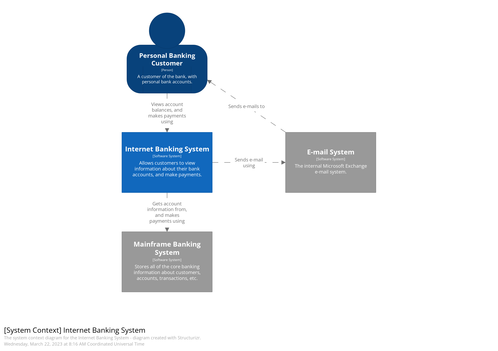

# Context and Scope

System delimitation from all its communication partners (neighboring systems and users, i.e. the context of your system).

Use a C4 System Context Diagram.

## Business Context Optional (OPTIONAL)

Specification of all communication partners (users, IT-systems, …​) with explanations of domain specific inputs and outputs or interfaces.

All kinds of diagrams that show the system as a black box and specify the domain interfaces to communication partners.

[Back](../README.md)
