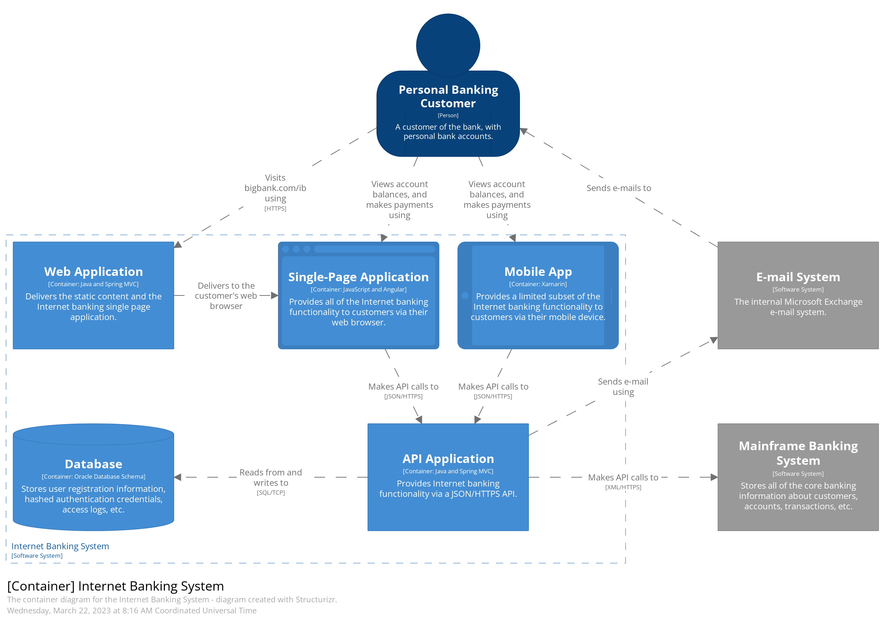

# Solution Strategy

A short summary and explanation of the fundamental decisions and solution strategies, that shape system architecture:

- Technology decisions.
- Decisions about the top-level decomposition of the system.
- Decisions on how to achieve key quality goals.

Use a C4 Container Diagram.

[Back](../README.md)
