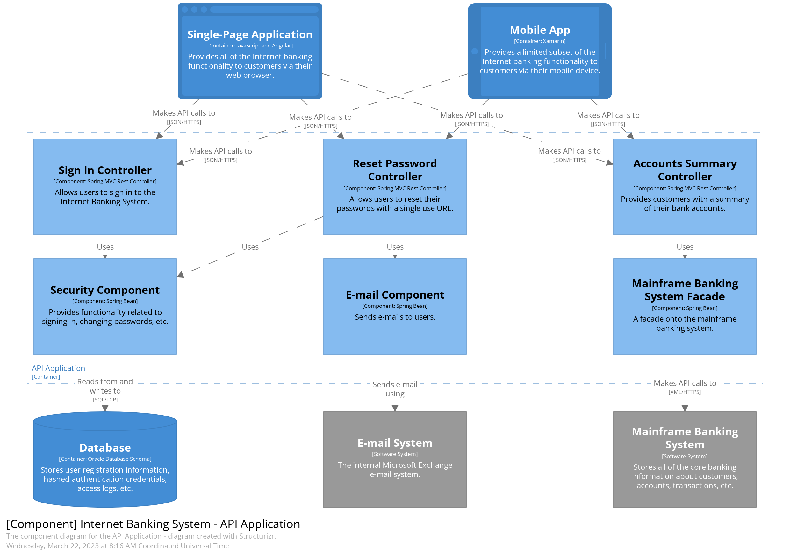

# Building Block View

Static decomposition of the system into building blocks:

- Modules, components, subsystems
- Classes, interfaces, packages, libraries, frameworks, layers, partitions, tiers, functions, macros
- Dependencies (relationships, associations, …​)

An overview of our source code by making its structure understandable through abstraction.

Use a C4 Container Diagram.

Use a C4 Container Diagram.

[Back](../README.md)
